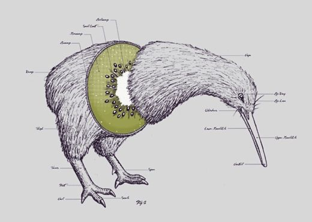

# Kiwi

Kiwi je interpretovaný a dynamicky typovaný dialekt programovacího jazyka Lisp.



## Datové typy

### number

64-bitové číslo s pohyblivou desetinnout čárkou.

```
> 42
42
> 2.718
2.718
```

### list

Spojový seznam, vyhodnocující se jako funkční volání, kde prvním prvkem je funkce a následující prvky jsou argumenty.

```
> (+ 1 2 3)
6
```

Vyhodnocení seznamu (zavolání funkce) lze zamezit funkcí `quote`.

```
> (quote (+ 1 2 3))
(+ 1 2 3)
> (quote (3 2 1))
(3 2 1)
```


### t

Pravdivá hodnota. Zárověň veškeré hodnoty, které nejsou `nil` jsou brány jako pravdivá hodnota.

```
> (= 1 1)
t
```

### nil

Nepravdivá hodnota a zároveň prázdný seznam.

```
> (= 1 2)
nil
> (= nil ())
t
```

### symbol

Symbol funguje obdobně jako proměnná z jiných programovacích jazyků. Hodnotu symbolu lze přiřadit funkcí `set!`.

```
> (set! two 2)
2
> two
2
```

Při pokusu o vyhodnocení symbolu, který nemá přiřazenou hodnotu, je zobrazena chybová hláška.

```
> clark-nova
Runtime error: Unable to resolve symbol "clark-nova" in this context
```

### function

Funkci lze vytvořit funkcí `fun`, kde prvním argumentem je seznam parametrů a druhým argumentem tělo funkce.

```
> (set! double (fun (a) (* a 2)))
kiwi.core.FunctionFactory$RuntimeFunction@14ae5a5
> (double 3)
6
```

Obdobně lze deklarovat i rekurzivní funkci.

```
> (set! pow (fun (a n) (if (< n 1) 1 (* a (pow a (- n 1))))))
kiwi.core.FunctionFactory$RuntimeFunction@7f31245a
> (pow 2 3)
8
```

Kiwi je silně typovaný jazyk, tudíž nelze funkci předat jiný, než definovaný počet argumentů.

```
> (set! identity (fun (x) x))
kiwi.core.FunctionFactory$RuntimeFunction@14ae5a5
> (identity)
Runtime error: Passed too few arguments to callable
> (identity 1 2)
Runtime error: Passed too many arguments to callable
```

Funkce můžu přijímat i proměnný počet argumentů. Slouží k tomu prefix `..` u názvu parametru.

```
> (set! rest (fun (x ..xs) xs))
kiwi.core.FunctionFactory$RuntimeFunction@7f31245a
> (rest 1 2 3)
(2 3)
> (rest 1)
nil
```

## Předdefinované funkce

- Aritmetické funkce `+`, `-`, `*`, `/`, `mod`.
- Porovnávání `=`, `>`, `>=`, `<`, `<=`.
- `(not [expr])`: Negace výrazu `[expr]`.
- `(if [predicate] [then] [otherwise])`: Podmínka
- `(fun [params] [body])`: Vytvoří novou funkci.
- `(apply [fun] [args])`: Zavolá funkci `[fun]` s argumenty `[args]`.
- `(set! [symbol] [expr])`: Přiřadí symbolu `[symbol]` hodnotu `[expr]`.
- `(quote [expr])`: Zabrání vyhodnocení výrazu `[expr]`.
- `(map [fun] [list])`: Aplikuje funkci `[fun]` na každý prvek seznamu `[list]`.
- `(filter [fun] [list])`: Zavolá funkci `[fun]` na každý prvek seznamu `[list]`. Pokud je výsledek funknce `[fun]` pravdivá hodnota, zahrne prvek do výsledného seznamu.
- `(range [start] [end])`: Vytvoří seznam, obsahující čísla v rozsahu `[start]` až `[end]`.
- `(time)`: Počet uplynulých sekund od aprílu léta Páně 2016.
- `(println [expr])`: Vypíše hodnotu výrazu `[expr]` na standardní výstup.
